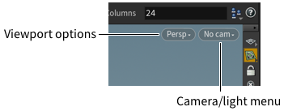
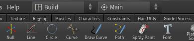
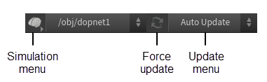

# Интерфейс и основы Houdini

> Основано на официальной документации SideFX (`houdini_help/basics/`)  
> Используется в модуле: [[Houdini-Learning/Theory/01-Interface-Basics]]

---

## 🧩 Основные концепции

Houdini — это **процедурная система**, где вы создаёте сети нод, описывающих шаги для достижения результата. Это даёт:

- Возможность **возвращаться назад** и менять решения без пересоздания сцены.
- Поддержку **быстрого прототипирования**.
- Эффективную работу с **крупными и сложными сценами**.
- Возможность **упаковки сетей в цифровые ассеты** без написания кода.

---

## 🖥️ Пользовательский интерфейс

Houdini состоит из следующих ключевых компонентов:

| Компонент | Назначение |
|----------|-----------|
| **Main menus** | Доступ к общим функциям (файлы, рендер, настройки) |
| **Shelf** | Инструменты для быстрого создания геометрии и эффектов |
| **3D Scene View** | 3D-просмотр сцены |
| **Toolbox** | Инструменты выбора, трансформации, навигации |
| **Operation toolbar** | Контролы для текущего узла над Viewport'ом |
| **Display options** | Быстрый доступ к настройкам отображения (справа от Viewport'а) |
| **Parameter editor** | Редактор параметров выбранного узла |
| **Network editor** | Рабочая область для создания сетей нод |
| **Playbar** | Управление воспроизведением анимации |
| **Status line** | Строка состояния внизу окна |
| **Cook controls** | Контроль пересчёта сцены |

---

## 👁️ Навигация в Viewport'е

Для навигации используйте **Space + мышь**:

| Действие | Горячая клавиша | Видео |
|---------|------------------|-------|
| Tumble (вращение) | `Space + ЛКМ` | [Tumbling](videos/tumbling.mp4) |
| Dolly (приближение) | `Space + ПКМ` или колёсико | |
| Track (перемещение) | `Space + СКМ` | |
| Box Zoom | `Ctrl + Alt + ЛКМ` | |
| Box Crop | `Ctrl + Alt + ПКМ` | |
| Screen Pan | `Ctrl + Alt + СКМ` | |
| Home (показать всё) | `Space + A` | |
| Home Selected | `Space + G` | |
| Home Grid | `Space + H` | |

> 💡 Совет: удерживайте `Shift` во время навигации для большей точности.

---

## 🖱️ Выбор объектов и компонентов

### Режимы выбора
- **Object mode** (`1`) — выбор объектов сцены.
- **Component mode** (`2–5`) — выбор точек, рёбер, примитивов, вершин.
- **Dynamics mode** (`7`) — выбор частиц и динамических объектов.

### Горячие клавиши
- Выбрать: `ЛКМ`
- Добавить к выбору: `Shift + ЛКМ`
- Удалить из выбора: `Ctrl + ЛКМ`
- Переключить выбор: `Ctrl + Shift + ЛКМ`
- Выбрать всё: `N`
- Отменить выбор: `Shift + N`

Видео:
- [Select Primitives](videos/select_primitives.mp4)
- [Selection by Normal](videos/selection_by_normal.mp4)
- [Selection Pattern](videos/selection_pattern.mp4)

---

## 🧰 Toolbox

Toolbox (слева от Viewport'а) содержит:

- **Select tools** — выбор объектов/компонентов.
- **Transform tools** — перемещение, вращение, масштаб.
- **View tool** — временный доступ к навигации (`Space`).
- **Inspect tool** — информация о геометрии под курсором.
- **Render Region** — рендер области просмотра.

---

## 📂 Desktops и Panes

Houdini использует **панели (panes)**, которые можно:
- Разделять, сворачивать, максимизировать.
- Сохранять как **Desktops** (предустановки интерфейса).

Чтобы создать новый Desktop:
1. Откройте меню Desktops (вверху окна).
2. Выберите **Save current desktop as**.

---

## 🔄 Cooking

**Cooking** — процесс пересчёта сцены. Вы можете:
- Отменить пересчёт: `Esc`
- Включить/выключить автоматический пересчёт: кнопка **Auto Update** внизу окна.
- Принудительно пересчитать: кнопка **Force Update**.

---

## 🎥 Рекомендуемые видео

- [Tumbling & Navigation](videos/tumbling.mp4)
- [Move Along View](videos/basics_handles_movealongview.mp4)
- [Move Along Construction Plane](videos/basics_handles_movealongcp.mp4)
- [Layout & Workspace](videos/layout.mp4)
- [Place Objects](videos/layout_place.mp4)
- [Selection Pattern](videos/selection_pattern.mp4)

> 💡 Чтобы открыть видео: перейдите в папку `Docs/Houdini-Reference/videos/` и запустите файл.

---

## 📚 См. также

- [[01-Interface-Basics]]
- [[01-Procedural-Box]]